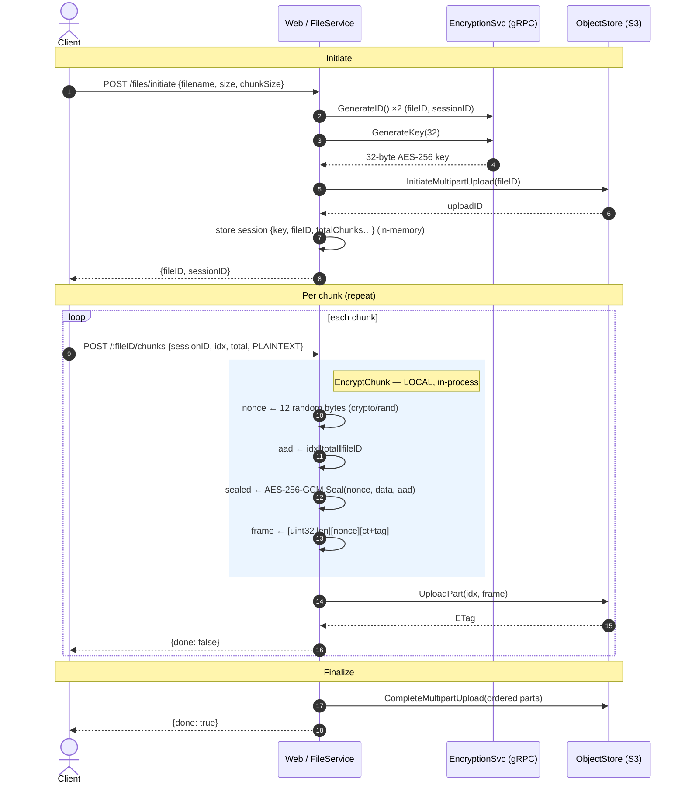
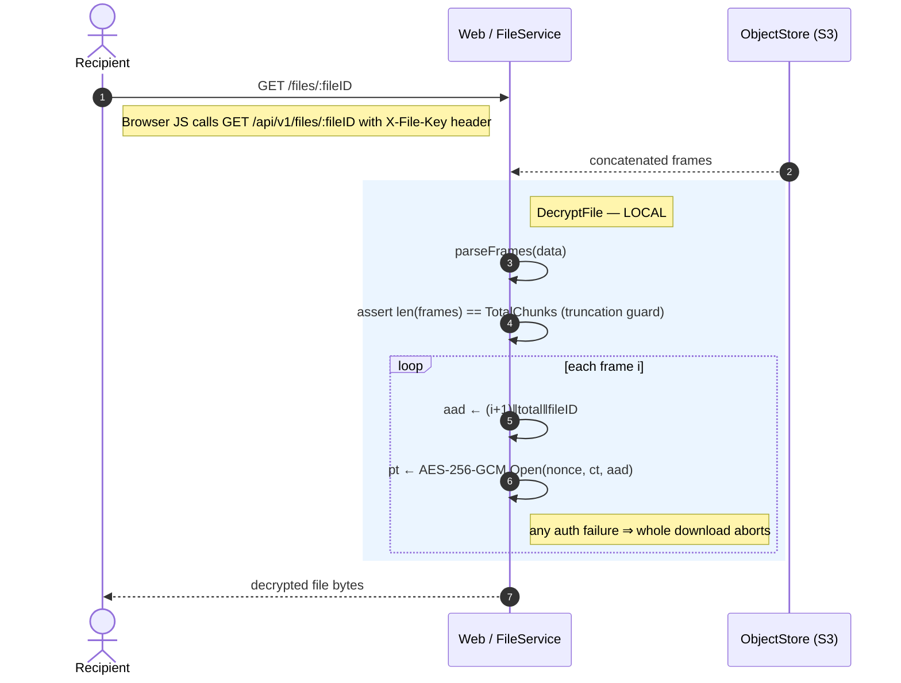
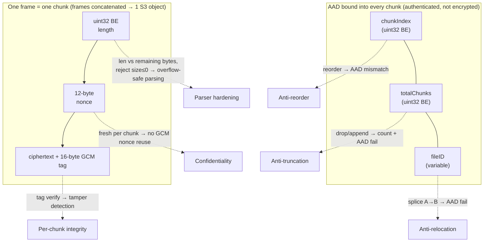
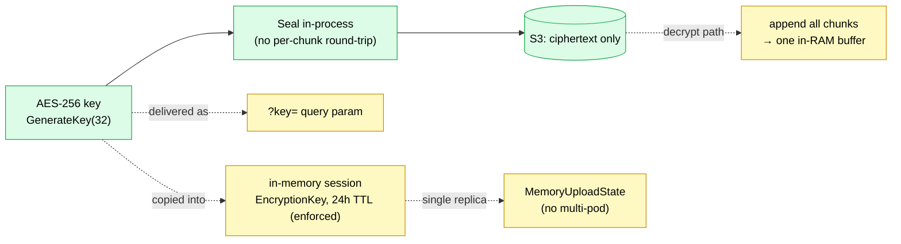

# Encrypted Chunked File Upload

This document describes how chunked file uploads are encrypted, stored, and
decrypted, and the security properties (and operational caveats) of the design.

## Overview

Files are uploaded in chunks, each sealed locally with **AES-256-GCM** before
being stored as a part of an S3-compatible multipart upload. Each chunk binds
its file ID, one-based index, and total chunk count as **additional
authenticated data (AAD)**, so reordered, truncated, relocated, or tampered
ciphertext fails authentication on decrypt.

Encryption and decryption happen **in-process** in the web/file service. The
shared encryption gRPC service is used only as an ID/key oracle (`GenerateID`,
`GenerateKey`) — chunk bytes never round-trip to it.

Key source files:

- `app/internal/domains/message/adapters/secondary/crypto/file_encryption.go` — local AES-256-GCM seal/open + framing
- `app/internal/domains/message/domain/file_service.go` — upload/download/abort orchestration
- `app/internal/domains/message/adapters/secondary/s3/object_storage.go` — S3 multipart adapter
- `app/internal/domains/message/adapters/secondary/memory/upload_state.go` — in-memory session/state
- `app/internal/domains/message/adapters/primary/api/file_handlers.go` — REST endpoints

## Upload — sealing the vault



## Download — cracking it open



## Frame format + what each field defends



The on-disk layout per chunk:

```
 ┌──────────┬──────────────┬───────────────────────────────┐
 │ uint32   │  12-byte     │  ciphertext + 16-byte GCM tag  │
 │ BE length│  nonce       │                                │
 └──────────┴──────────────┴───────────────────────────────┘
 └───────────────── one frame, one chunk ───────────────────┘
   frames are simply concatenated → stored as one S3 object
```

The AAD is constructed as fixed-width `chunkIndex ‖ totalChunks` (each a
big-endian `uint32`) followed by the variable-length `fileID`, so the encoding
is unambiguous and both the encrypt and decrypt sides reconstruct identical
bytes. The AAD is authenticated, not encrypted: tampering with position, count,
or file identity causes GCM tag verification to fail.

## Why it's secure

| Property | Mechanism | What it stops |
|---|---|---|
| **Confidentiality** | AES-256-GCM, 32-byte key | Anyone reading the S3 object (or the storage provider) sees only ciphertext |
| **Per-chunk integrity** | 16-byte GCM auth tag on every frame | Bit-flipping / tampering — `Open` fails, download aborts |
| **Anti-reorder** | `chunkIndex` (1-based) bound as AAD | Swapping chunk 3 and 7 → AAD mismatch → auth failure |
| **Anti-truncation / padding** | `totalChunks` in AAD **+** `len(frames) == TotalChunks` check | Dropping or appending chunks fails both the count check and AAD auth |
| **Anti-relocation** | `fileID` bound as AAD | Splicing a chunk from file A into file B fails auth |
| **Nonce safety** | Fresh 12-byte CSPRNG nonce per chunk (`crypto/rand`) | GCM nonce reuse, which catastrophically breaks GCM |
| **Parser hardening** | Frame length compared against *remaining* bytes; rejects `size <= 0` | `uint32`→`int` overflow on 32-bit platforms and malformed/hostile framing |

## Security model at a glance



Green is the cryptographic core, which is solid. Yellow marks the operational
edges where the "zero-knowledge" promise is softer than it first appears.

## Operational caveats

These are not breaks in the AES-256-GCM core — they are edges in the surrounding
secrecy model worth tracking:

1. **The key is delivered client-side and sent via an HTTP header.** The share link
   carries the key in the URL fragment (`#/...`) so it never reaches the server on
   initial navigation. The browser then calls `GET /api/v1/files/:fileID` with
   `X-File-Key: <base64url>` to decrypt and download the file.

2. **The symmetric key is stored server-side** in the in-memory upload session
   (`EncryptionKey`, `contracts.FileUploadSession`). During an active upload the
   design is not purely zero-knowledge — anyone with web-process memory access
   has the key. Download itself uses the client-supplied key, but the session
   copy still lives in RAM. The 24h TTL (`ExpiresAt`) **is now enforced** for
   incomplete sessions: `UploadChunk` rejects an expired session with
   `ErrUploadSessionExpired` (HTTP 410 Gone), and a background janitor
   (`FileService.RunSessionCleanup`, hourly) sweeps expired incomplete sessions
   — freeing their key from memory and best-effort aborting the dangling S3
   multipart upload.

   The remaining limitation: **completed** sessions are retained in memory (and
   keep their key) indefinitely so finalized files stay downloadable — completed
   S3 objects don't expire today, so there is no lifecycle to evict them against.

3. **`MemoryUploadStateAdapter` is single-replica only.** Sessions vanish on
   restart and are not shared across pods — a blocker for horizontal scaling.
   The expiry janitor above only sweeps the local replica's map.

4. **`DecryptFile` buffers the whole file in memory**, appending all chunks into
   one `[]byte`. `maxFileSize` guards initiation, but the decrypt path trusts
   stored data and allocates proportionally to file size.
